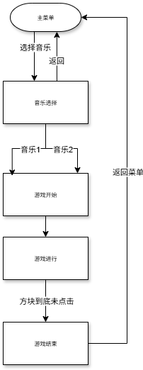

# 钢琴块 Piano_Blocks

## 项目介绍
这是一个基于LVGL图形库开发的钢琴块节奏游戏。玩家需要根据点击或长按从屏幕顶部下落的黑色（点击）和灰色（长按）方块来获得分数。

## 作者
    范宗涛

## 时间
    2025.07.28 - 2025.07.30

## 版本
    V1.0

## 文件说明

```
Piano_Blocks/
├── assets/                # 资源文件（图片、音乐等）
│   └── music/             # 音乐文件目录（存放游戏音乐）
├── bin/                   # 编译输出目录（可执行文件）
├── build/                 # 构建过程文件（临时文件）
├── lvgl/                  # LVGL 图形库源码目录
├── my_code/               # 项目核心代码目录
│   ├── inc/               # 头文件目录
│   │   ├── game_logic.h   # 游戏逻辑头文件
│   │   ├── ui_manager.h   # 界面管理头文件
│   │   └── utils.h        # 工具函数头文件
│   └── src/               # 源文件目录
│       ├── game_logic.c   # 游戏核心逻辑实现
│       ├── ui_manager.c   # 界面管理实现
│       └── utils.c        # 工具函数实现
├── CMakeLists.txt         # CMake 构建脚本
├── lv_conf.h              # LVGL 配置文件
├── lv_myec_font.h         # 自定义字体配置（LVGL）
├── main.c                 # 程序入口文件
├── Makefile               # Make 构建脚本
├── mouse_cursor_icon.c    # 鼠标光标图标资源
└── README.md              # 项目说明文档
```

## 操作说明
1. **主菜单**：
- 点击"选择音乐"按钮进入音乐选择界面
- "待开发"按钮为预留功能

2. **音乐选择**：
- 选择"音乐1"或"音乐2"开始游戏
- 点击"返回"回到主菜单

3. **游戏界面**：
- 点击黑色方块获得1分
- 长按灰色方块获得3分
- 方块到达屏幕底部未点击则游戏结束

4. **结算界面**：
- 显示最终得分
- 点击"返回菜单"回到主界面

## 游戏流程图



## 开发环境
- 硬件：GEC6818 开发板
- 输入：开发板触摸屏 (/dev/input/event0)
- 显示：开发板触摸屏(/dev/fb0)
- 音频：madplay播放器
- 图形库：LVGL

## 编译运行
1. 确保已安装LVGL库和madplay播放器
2. 在linux下编译项目：
```bash
rm -rf build
mkdir build
cd build
cmake ..
make -j
```
3. 将文件使用U盘拷贝到开发板GEC6818
3. 运行游戏：
```bash
cp /mnt/udisk/main .
chmod 0777 main
./main
```
## 注意事项
开发板操作中:
记得在开发板的main同级目录下 mkdir music
将音频文件放在下面

开发板下文件结构参考如下:
```
Piano_Blocks/
├── music/                # 资源文件（图片、音乐等）
│   ├── music1            # 头文件目录
│   └── music2            # 音乐文件目录（存放游戏音乐）
└── main                  # 项目说明文档
```
